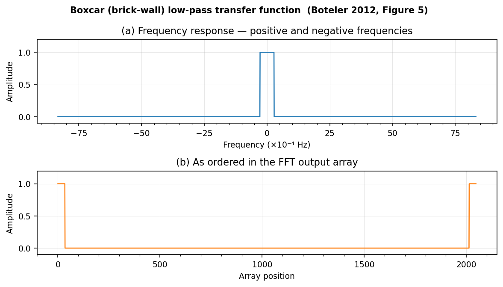
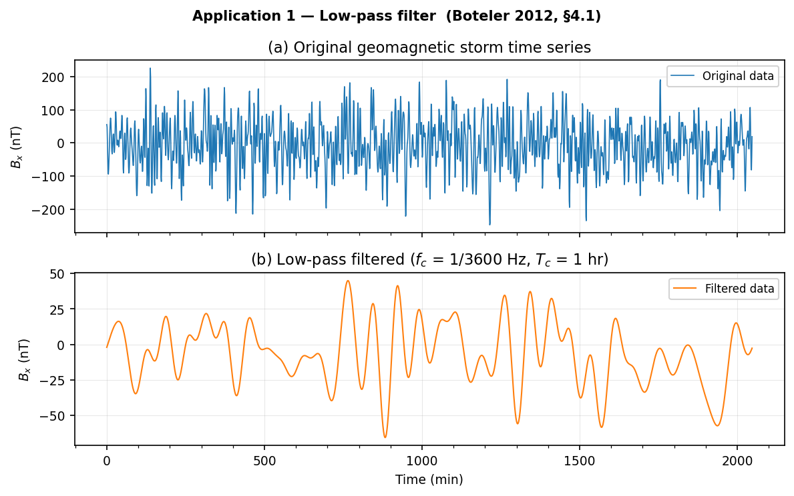

<!--
Author(s): Shibaji Chakraborty
-->

# Example 1 — Low-Pass Filter

*Corresponds to Boteler (2012) Application 1, §4.1.*

This example applies a brick-wall low-pass filter at a 1-hour period to a
synthetic geomagnetic storm time series sampled at 1-minute cadence — the
same scenario studied in the paper using data from the Victoria Magnetic
Observatory.

!!! info "Either transform pair works here"
    For a *pair* of transforms (FFT → multiply → IFFT), the CC and CD
    conventions give identical results because the combined scale factor
    \(\Delta t \cdot \Delta f = 1/N\) is the same in both cases
    (Boteler §4.1). Use whichever feels more natural; `fft_filter` uses
    the CC pair internally.

---

## Transfer function

The brick-wall low-pass transfer function, shown in both physical frequency
ordering and FFT-array order:



---

## Result

Original geomagnetic storm time series (top) and its low-pass filtered
version retaining only periods longer than 1 hour (bottom):



---

## Code

=== "Python"

    ```python
    import numpy as np
    from universalfft import fft_filter, freqs
    from universalfft.utils import low_pass_response

    rng = np.random.default_rng(42)
    N, dt = 2048, 60.0
    x = rng.standard_normal(N)

    f  = freqs(N, dt)
    fc = 1.0 / 3600.0
    H  = low_pass_response(f, fc).astype(complex)

    y = fft_filter(x, H, dt)
    print("Max imaginary residual:", np.max(np.abs(np.imag(y))))
    ```

=== "C"

    ```c
    #include "universalfft.h"
    #include <math.h>

    /* N=2048, dt=60.0 */
    ufft_freqs(f, N, dt);
    for (size_t k = 0; k < N; k++) {
        H_re[k] = fabs(f[k]) <= 1.0/3600.0 ? 1.0 : 0.0;
        H_im[k] = 0.0;
    }
    ufft_filter(x_re, x_im, H_re, H_im, y_re, y_im, N, dt);
    ```

=== "C++"

    ```cpp
    #include "universalfft.hpp"
    using namespace ufft;

    int N = 2048; double dt = 60.0;
    auto f = freqs(N, dt);
    cvec H = low_pass_response(f, 1.0/3600.0);

    cvec x_c(x.begin(), x.end());      // wrap real signal as complex
    cvec y = fft_filter(x_c, H, dt);
    ```

=== "Fortran"

    ```fortran
    use universalfft_mod
    use iso_fortran_env, only: dp => real64
    implicit none
    integer,  parameter :: N  = 2048
    real(dp), parameter :: dt = 60.0_dp, fc = 1.0_dp/3600.0_dp
    real(dp) :: f(0:N-1), H_r(0:N-1), H_i(0:N-1)
    real(dp) :: x_r(0:N-1), x_i(0:N-1), y_r(0:N-1), y_i(0:N-1)
    integer  :: rc

    call ufft_freqs(f, N, dt)
    call ufft_low_pass(H_r, f, N, fc)
    H_i = 0.0_dp
    x_i = 0.0_dp                       ! real input
    rc = ufft_filter(x_r, x_i, H_r, H_i, y_r, y_i, N, dt)
    ```

=== "Julia"

    ```julia
    using UniversalFFT

    N, dt = 2048, 60.0
    x = randn(N)

    f = freqs(N, dt)
    H = low_pass_response(f, 1/3600)

    y = fft_filter(x, H, dt)
    println("Max imag residual: ", maximum(abs.(imag.(y))))
    ```

=== "Rust"

    ```rust
    use universalfft::*;

    let n: usize = 2048;
    let dt = 60.0f64;
    let f = freqs(n, dt);
    let H = low_pass_response(&f, 1.0 / 3600.0);

    // x: Vec<f64>  — real signal
    let y = fft_filter(&x, &H, dt);
    let max_imag = y.iter().map(|v| v.im.abs()).fold(0.0f64, f64::max);
    println!("Max imag residual: {:.2e}", max_imag);
    ```

=== "MATLAB"

    ```matlab
    addpath('matlab/')
    N = 2048;  dt = 60.0;
    rng(42);
    x = randn(N, 1);

    f  = ufft_freqs(N, dt);
    H  = double(abs(f) <= 1/3600) + 0i;

    y  = ufft_filter(x, H, dt);
    fprintf('Max imag residual: %.2e\n', max(abs(imag(y))));
    ```

=== "R"

    ```r
    source("r/universalfft.R")
    set.seed(42)
    N <- 2048L;  dt <- 60.0
    x <- rnorm(N)

    f  <- ufft_freqs(N, dt)
    H  <- ufft_lowpass(f, 1/3600) + 0i

    y  <- ufft_filter(x, H, dt)
    cat("Max imag residual:", max(abs(Im(y))), "\n")
    ```

=== "JavaScript"

    ```js
    import { fftFilter, freqs, lowPassResponse } from "./universalfft.js";

    const N = 2048, dt = 60.0;
    // x: Float64Array of real signal samples
    const f = freqs(N, dt);
    const H = lowPassResponse(f, 1 / 3600);

    const y = fftFilter(x, H, dt);
    const maxImag = Math.max(...y.im.map(Math.abs));
    console.log(`Max imag residual: ${maxImag.toExponential(2)}`);
    ```

=== "Octave"

    ```matlab
    source('octave/universalfft.m')
    N = 2048;  dt = 60.0;
    x = randn(N, 1);

    f  = ufft_freqs(N, dt);
    H  = ufft_low_pass(f, 1/3600);

    y  = ufft_filter(x, H, dt);
    fprintf('Max imag residual: %.2e\n', max(abs(imag(y))));
    ```

=== "CUDA / HIP"

    ```c
    #include "universalfft.cuh"
    #include <math.h>

    /* N=2048, dt=60.0 — host arrays; device memory managed internally */
    ufft_freqs_cpu(f, N, dt);
    for (int k = 0; k < N; k++) {
        H_re[k] = fabs(f[k]) <= 1.0/3600.0 ? 1.0 : 0.0;
        H_im[k] = 0.0;
    }
    ufft_filter_host(x_re, x_im, H_re, H_im, y_re, y_im, N, dt);
    ```

=== "IDL / GDL"

    ```idl
    ; GDL (free): gdl idl/universalfft.pro
    ; IDL:        idl -e "@idl/universalfft.pro"
    @universalfft.pro

    N = 2048L & dt = 60.0D & fc = 1D/3600D
    x = RANDOMN(seed, N)
    f = ufft_freqs(N, dt)
    H = ufft_low_pass(f, fc)

    y = ufft_filter(x, H, dt)
    PRINT, 'Max imag residual:', MAX(ABS(IMAGINARY(y)))
    ```
