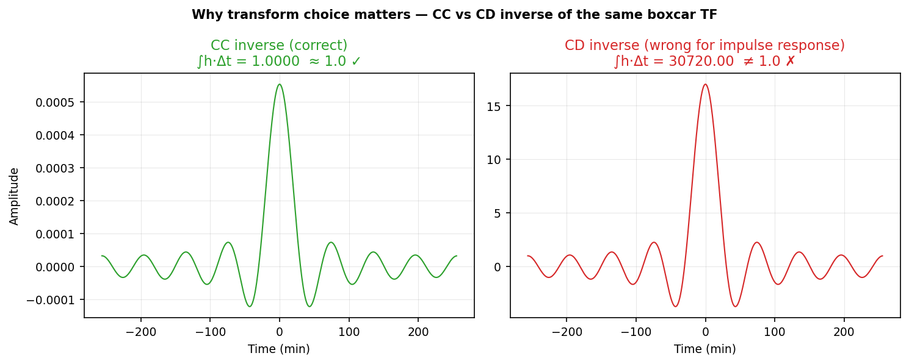

<!--
Author(s): Shibaji Chakraborty
-->

# Example 2 — Impulse Response

*Corresponds to Boteler (2012) Application 2, §4.2.*

The impulse response of a filter is obtained by taking the inverse Fourier
transform of its frequency-domain transfer function. This requires the
**CC inverse** — not the CD inverse — because we are approximating the
Fourier integral of a continuous function.

The physical check is that the impulse response of a low-pass filter
(sinc function in the time domain) integrates to 1:

\[
\sum_{n=0}^{N-1} h[n] \, \Delta t = 1
\]

!!! warning "Wrong choice → wrong scaling"
    The CD inverse of the same boxcar transfer function gives a sinc whose
    integral equals \(N \cdot \Delta f \neq 1\). The shape is identical but
    the amplitude is off by a factor of \(N \cdot \Delta f\).
    UniversalFFT's test suite explicitly verifies this distinction.

---

## CC vs CD inverse — why it matters

Both transforms produce a sinc-shaped curve, but only the CC inverse
integrates to 1. The CD inverse (right panel, red) is off by a factor of
\(N \cdot \Delta f\):



---

## Result — sinc impulse response (CC inverse)

The sinc function in FFT-array order (a) and as a function of positive and
negative time (b). The confirmed integral \(\approx 1.0\) is annotated:


---

## Code

=== "Python"

    ```python
    import numpy as np
    from universalfft import ifft_cc, freqs
    from universalfft.utils import low_pass_response, sinc_integral_check

    N, dt = 2048, 60.0
    f  = freqs(N, dt)
    H  = low_pass_response(f, 1.0/3600.0).astype(complex)

    h = ifft_cc(H, dt)                  # CC inverse — required
    integral = np.sum(np.real(h)) * dt
    print(f"Integral = {integral:.8f}  (expect 1.0)")
    assert sinc_integral_check(h, dt, tol=1e-4)
    ```

=== "C"

    ```c
    #include "universalfft.h"
    #include <math.h>
    #include <stdio.h>

    /* N=2048, dt=60.0 */
    ufft_freqs(f, N, dt);
    for (size_t k = 0; k < N; k++) {
        H_re[k] = fabs(f[k]) <= 1.0/3600.0 ? 1.0 : 0.0;
        H_im[k] = 0.0;
    }
    ufft_cc_inverse(H_re, H_im, h_re, h_im, N, dt);  /* CC inverse */

    double integral = 0.0;
    for (size_t n = 0; n < N; n++) integral += h_re[n];
    integral *= dt;
    printf("Integral = %.8f  (expect 1.0)\n", integral);
    ```

=== "C++"

    ```cpp
    #include "universalfft.hpp"
    using namespace ufft;

    int N = 2048; double dt = 60.0;
    auto f = freqs(N, dt);
    cvec H = low_pass_response(f, 1.0/3600.0);

    cvec h = ifft_cc(H, dt);           // CC inverse — required

    double integral = 0.0;
    for (auto& v : h) integral += v.real();
    integral *= dt;
    printf("Integral = %.8f  (expect 1.0)\n", integral);
    ```

=== "Fortran"

    ```fortran
    use universalfft_mod
    use iso_fortran_env, only: dp => real64
    implicit none
    integer,  parameter :: N  = 2048
    real(dp), parameter :: dt = 60.0_dp, fc = 1.0_dp/3600.0_dp
    real(dp) :: f(0:N-1), H_r(0:N-1), H_i(0:N-1)
    real(dp) :: h_r(0:N-1), h_i(0:N-1)
    integer  :: rc

    call ufft_freqs(f, N, dt)
    call ufft_low_pass(H_r, f, N, fc)
    H_i = 0.0_dp

    rc = ufft_cc_inverse(H_r, H_i, h_r, h_i, N, dt)  ! CC inverse
    print *, "Integral =", sum(h_r) * dt, " (expect 1.0)"
    ```

=== "Julia"

    ```julia
    using UniversalFFT

    N, dt = 2048, 60.0
    f = freqs(N, dt)
    H = low_pass_response(f, 1/3600)

    h = ifft_cc(H, dt)                 # CC inverse — required
    integral = sum(real.(h)) * dt
    println("Integral = $integral  (expect 1.0)")
    @assert abs(integral - 1.0) < 1e-4
    ```

=== "Rust"

    ```rust
    use universalfft::*;

    let n: usize = 2048;
    let dt = 60.0f64;
    let f = freqs(n, dt);
    let H = low_pass_response(&f, 1.0 / 3600.0);

    let h = ifft_cc(&H, dt);           // CC inverse — required
    let integral: f64 = h.iter().map(|v| v.re).sum::<f64>() * dt;
    println!("Integral = {:.8}  (expect 1.0)", integral);
    assert!(sinc_integral_check(&h, dt, 1e-4));
    ```

=== "MATLAB"

    ```matlab
    addpath('matlab/')
    N = 2048;  dt = 60.0;
    f = ufft_freqs(N, dt);
    H = double(abs(f) <= 1/3600) + 0i;

    h = ufft_cc_inverse(H, dt);        % CC inverse — required
    fprintf('Integral = %.8f  (expect 1.0)\n', sum(real(h)) * dt);
    ```

=== "R"

    ```r
    source("r/universalfft.R")
    N <- 2048L;  dt <- 60.0
    f <- ufft_freqs(N, dt)
    H <- ufft_lowpass(f, 1/3600) + 0i

    h <- ufft_cc_inverse(H, dt)        # CC inverse — required
    cat(sprintf("Integral = %.8f  (expect 1.0)\n", sum(Re(h)) * dt))
    ```

=== "JavaScript"

    ```js
    import { ifftCC, freqs, lowPassResponse } from "./universalfft.js";

    const N = 2048, dt = 60.0;
    const f = freqs(N, dt);
    const H = lowPassResponse(f, 1 / 3600);

    const h = ifftCC(H, dt);           // CC inverse — required
    const integral = h.re.reduce((s, v) => s + v * dt, 0);
    console.log(`Integral = ${integral.toFixed(8)}  (expect 1.0)`);
    ```

=== "Octave"

    ```matlab
    source('octave/universalfft.m')
    N = 2048;  dt = 60.0;
    f = ufft_freqs(N, dt);
    H = ufft_low_pass(f, 1/3600);

    h = ufft_cc_inverse(H, dt);        % CC inverse — required
    fprintf('Integral = %.8f  (expect 1.0)\n', sum(real(h)) * dt);
    ```

=== "CUDA / HIP"

    ```c
    #include "universalfft.cuh"
    #include <math.h>
    #include <stdio.h>

    /* N=2048, dt=60.0 — host arrays; device memory managed internally */
    ufft_freqs_cpu(f, N, dt);
    for (int k = 0; k < N; k++) {
        H_re[k] = fabs(f[k]) <= 1.0/3600.0 ? 1.0 : 0.0;
        H_im[k] = 0.0;
    }
    ufft_cc_inverse_host(H_re, H_im, h_re, h_im, N, dt);  /* CC inverse */

    double integral = 0.0;
    for (int n = 0; n < N; n++) integral += h_re[n];
    integral *= dt;
    printf("Integral = %.8f  (expect 1.0)\n", integral);
    ```

=== "IDL / GDL"

    ```idl
    ; GDL (free): gdl idl/universalfft.pro
    ; IDL:        idl -e "@idl/universalfft.pro"
    @universalfft.pro

    N = 2048L & dt = 60.0D & fc = 1D/3600D
    f = ufft_freqs(N, dt)
    H = ufft_low_pass(f, fc)

    h = ufft_cc_inverse(H, dt)         ; CC inverse — required
    PRINT, 'Integral =', TOTAL(REAL_PART(h)) * dt, '  (expect 1.0)'
    ```
