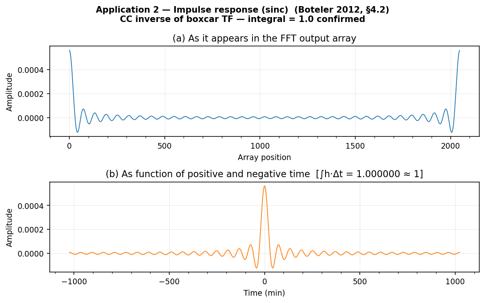
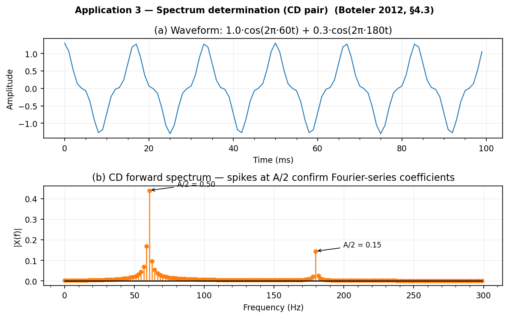
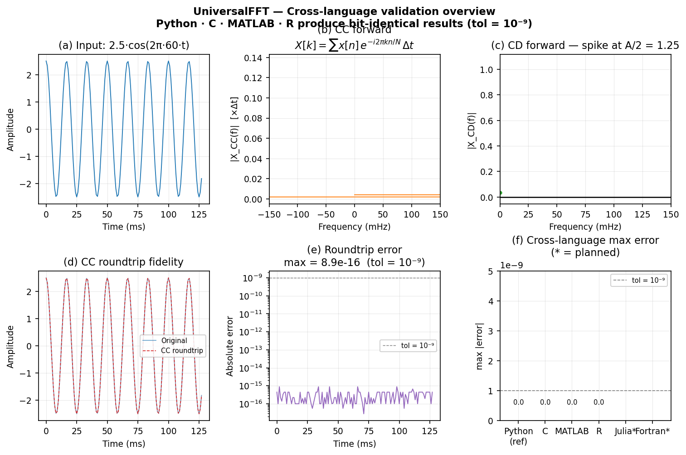

<!--
Author(s): Shibaji Chakraborty
-->

# UniversalFFT

<div class="hero">
  <h2>Physically Correct FFT/IFFT Across 11 Languages</h2>
  <p>
    UniversalFFT enforces the Fourier transform conventions described by Boteler (2012)
    for geoscience applications — so your impulse responses, spectra, and filters are
    numerically identical across Python, C, C++, Fortran, Julia, Rust, MATLAB, R,
    JavaScript, Octave, and CUDA/HIP within a tolerance of 10⁻⁹.
  </p>
</div>

!!! warning "Beta Status"
    UniversalFFT is in active development. APIs and documentation may change as features are added and validated.

[](https://choosealicense.com/licenses/mit/)
[](https://www.python.org/downloads/)
[](https://universalfft.readthedocs.io/en/latest/)
[](https://github.com/shibaji7/UniversalFFT)

Every FFT library makes silent choices about scaling factors and sign conventions. A `numpy.fft.ifft` and R's `fft(inverse=TRUE)` compute different things despite both calling themselves "inverse FFT". For a *pair* of transforms (FFT → process → IFFT) the scale factors cancel and you never notice. But for a *single* transform — recovering a filter's impulse response, or determining the discrete spectrum of a periodic waveform — an inconsistent convention silently mis-scales the result by a factor of N·Δt or N·Δf, an engineering error that is easy to miss and hard to trace back to a normalisation mismatch.

UniversalFFT anchors every choice to the Fourier integral in frequency \(f\) (not \(\omega\)), following Boteler (2012), so that Parseval's theorem holds without any \(2\pi\) factor and the impulse response of a lowpass filter integrates to 1.

## Quick Start

=== "Python"

    ```bash
    pip install -e python/
    ```

    ```python
    import numpy as np
    from universalfft import ifft_cc, freqs, fft_filter
    from universalfft.utils import low_pass_response

    N, dt = 2048, 60.0                   # 1-minute cadence magnetometer
    x = np.random.randn(N)

    f = freqs(N, dt)
    H = low_pass_response(f, fc=1/3600).astype(complex)
    y = fft_filter(x, H, dt)            # filtered signal
    h = ifft_cc(H, dt)                  # impulse response (CC inverse required)
    print(f"Integral = {np.sum(np.real(h)) * dt:.6f}  (expect 1.0)")
    ```

=== "C"

    ```bash
    cd c/ && make all
    ```

    ```c
    #include "universalfft.h"

    ufft_freqs(f, N, dt);
    for (size_t k = 0; k < N; k++) {
        H_re[k] = fabs(f[k]) <= 1.0/3600.0 ? 1.0 : 0.0;
        H_im[k] = 0.0;
    }
    ufft_filter(x_re, x_im, H_re, H_im, y_re, y_im, N, dt);
    ufft_cc_inverse(H_re, H_im, h_re, h_im, N, dt);
    ```

=== "C++"

    ```bash
    cd cpp/ && make all
    ```

    ```cpp
    #include "universalfft.hpp"
    using namespace ufft;

    auto f = freqs(N, dt);
    cvec  H = low_pass_response(f, 1.0/3600.0);
    cvec  y = fft_filter(x_c, H, dt);   // filtered signal
    cvec  h = ifft_cc(H, dt);           // impulse response
    ```

=== "Fortran"

    ```bash
    cd fortran/ && make all
    ```

    ```fortran
    use universalfft_mod
    use iso_fortran_env, only: dp => real64
    integer, parameter :: N = 2048
    real(dp), parameter :: dt = 60.0_dp
    real(dp) :: f(0:N-1), H_r(0:N-1), H_i(0:N-1)
    real(dp) :: y_r(0:N-1), y_i(0:N-1), h_r(0:N-1), h_i(0:N-1)
    integer  :: rc

    call ufft_freqs(f, N, dt)
    call ufft_low_pass(H_r, f, N, 1.0_dp/3600.0_dp)
    H_i = 0.0_dp
    rc = ufft_filter(x_r, x_i, H_r, H_i, y_r, y_i, N, dt)
    rc = ufft_cc_inverse(H_r, H_i, h_r, h_i, N, dt)
    print *, "Integral =", sum(h_r) * dt, " (expect 1.0)"
    ```

=== "Julia"

    ```bash
    cd julia/ && julia --project=. -e 'import Pkg; Pkg.instantiate()'
    ```

    ```julia
    using UniversalFFT

    N, dt = 2048, 60.0
    f = freqs(N, dt)
    H = low_pass_response(f, 1/3600)

    y = fft_filter(randn(N), H, dt)     # filtered signal
    h = ifft_cc(H, dt)                  # impulse response
    println("Integral = $(sum(real.(h)) * dt)  (expect 1.0)")
    ```

=== "Rust"

    ```bash
    cd rust/ && cargo build --release
    ```

    ```rust
    use universalfft::*;

    let n = 2048usize; let dt = 60.0f64;
    let f = freqs(n, dt);
    let H = low_pass_response(&f, 1.0 / 3600.0);
    let y = fft_filter(&x, &H, dt);    // filtered signal
    let h = ifft_cc(&H, dt);           // impulse response
    let integral: f64 = h.iter().map(|v| v.re).sum::<f64>() * dt;
    println!("Integral = {:.6}  (expect 1.0)", integral);
    ```

=== "MATLAB"

    ```matlab
    addpath('matlab/')
    N = 2048;  dt = 60.0;

    f = ufft_freqs(N, dt);
    H = double(abs(f) <= 1/3600) + 0i;
    y = ufft_filter(randn(N,1), H, dt);
    h = ufft_cc_inverse(H, dt);
    fprintf('Integral = %.6f  (expect 1.0)\n', sum(real(h)) * dt);
    ```

=== "R"

    ```r
    source("r/universalfft.R")
    N <- 2048L;  dt <- 60.0
    f <- ufft_freqs(N, dt)
    H <- ufft_lowpass(f, 1/3600) + 0i
    y <- ufft_filter(rnorm(N), H, dt)
    h <- ufft_cc_inverse(H, dt)
    cat(sprintf("Integral = %.6f  (expect 1.0)\n", sum(Re(h)) * dt))
    ```

=== "JavaScript"

    ```bash
    node js/demo.js
    ```

    ```js
    import { fftFilter, ifftCC, freqs, lowPassResponse } from "./universalfft.js";

    const N = 2048, dt = 60.0;
    const f = freqs(N, dt);
    const H = lowPassResponse(f, 1 / 3600);
    const y = fftFilter(x, H, dt);
    const h = ifftCC(H, dt);
    const integral = h.re.reduce((s, v) => s + v * dt, 0);
    console.log(`Integral = ${integral.toFixed(6)}  (expect 1.0)`);
    ```

=== "Octave"

    ```bash
    octave --no-gui octave/ufft_demo_octave.m
    ```

    ```matlab
    source('octave/universalfft.m')
    N = 2048;  dt = 60.0;
    f = ufft_freqs(N, dt);
    H = ufft_low_pass(f, 1/3600);
    y = ufft_filter(randn(N,1), H, dt);
    h = ufft_cc_inverse(H, dt);
    fprintf('Integral = %.6f  (expect 1.0)\n', sum(real(h)) * dt);
    ```

=== "CUDA / HIP"

    ```bash
    cd cuda/ && make          # NVIDIA
    cd cuda/ && make HIP=1    # AMD ROCm
    ```

    ```c
    #include "universalfft.cuh"

    ufft_freqs_cpu(f, N, dt);
    for (int k = 0; k < N; k++) {
        H_re[k] = fabs(f[k]) <= 1.0/3600.0 ? 1.0 : 0.0;
        H_im[k] = 0.0;
    }
    ufft_filter_host(x_re, x_im, H_re, H_im, y_re, y_im, N, dt);
    ufft_cc_inverse_host(H_re, H_im, h_re, h_im, N, dt);
    ```

=== "IDL / GDL"

    ```bash
    # GDL (free): sudo apt install gnudatalanguage
    gdl idl/universalfft.pro
    ```

    ```idl
    @universalfft.pro
    N = 2048L & dt = 60.0D
    f = ufft_freqs(N, dt)
    H = ufft_low_pass(f, 1D/3600D)
    y = ufft_filter(x, H, dt)
    h = ufft_cc_inverse(H, dt)
    PRINT, 'Integral =', TOTAL(REAL_PART(h)) * dt, '  (expect 1.0)'
    ```

## Gallery

<div class="doc-card-grid">
  <div class="doc-card">
    <strong>Low-pass filter</strong>
    <a href="examples/filter/"></a>
  </div>
  <div class="doc-card">
    <strong>Impulse response (sinc)</strong>
    <a href="examples/impulse_response/"></a>
  </div>
  <div class="doc-card">
    <strong>Spectrum (CD pair)</strong>
    <a href="examples/spectrum/"></a>
  </div>
  <div class="doc-card">
    <strong>Cross-language validation</strong>
    <a href="examples/cross_language/"></a>
  </div>
</div>

---

## Source Code

The library source code can be found on the [UniversalFFT GitHub](https://github.com/shibaji7/UniversalFFT) repository.

If you have any questions or concerns please submit an **Issue** on the [UniversalFFT GitHub](https://github.com/shibaji7/UniversalFFT) repository.

## Documentation Links

<div class="doc-card-grid">
  <div class="doc-card">
    <strong>Installation</strong>
    Setup guidance for all 11 languages.<br>
    <a href="user/install/">Open Installation</a>
  </div>
  <div class="doc-card">
    <strong>Conventions</strong>
    Mathematical evolution from Fourier series to the implementation.<br>
    <a href="user/conventions/">Open Conventions</a>
  </div>
  <div class="doc-card">
    <strong>Examples</strong>
    End-to-end worked examples: filter, impulse response, spectrum.<br>
    <a href="examples/">Open Examples</a>
  </div>
  <div class="doc-card">
    <strong>API Reference</strong>
    Function and header reference for all 11 languages.<br>
    <a href="dev/api_index/">Open API</a>
  </div>
  <div class="doc-card">
    <strong>Cross-Language Demo</strong>
    Same signal, 11 languages, bit-identical results.<br>
    <a href="examples/cross_language/">Open Demo</a>
  </div>
  <div class="doc-card">
    <strong>Citing & Authors</strong>
    Citation guidance and contributor listing.<br>
    <a href="user/citing/">Citing</a> | <a href="user/authors/">Authors</a>
  </div>
</div>
