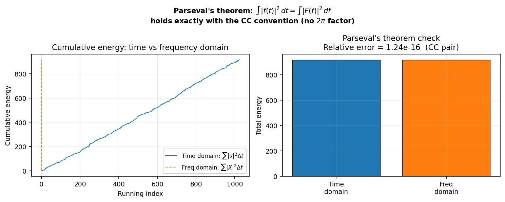

<!--
Author(s): Shibaji Chakraborty
-->

# Mathematical Conventions

This page traces the mathematical path from Fourier's original theorem to the
specific discrete transform conventions used in UniversalFFT. Each step
corresponds to a decision point that affects numerical results; the choices
here follow Boteler (2012) for physical correctness in geoscience applications.

---

## Stage 1 — Fourier Series (continuous, periodic)

Any band-limited periodic signal with period \(T\) can be represented exactly as

\[
s(t) = a_0 + \sum_{m=1}^{N} \left[ a_m \cos(mft) + b_m \sin(mft) \right]
\]

where \(f = 1/T\) is the fundamental frequency. Using Euler's identity collapses
the sum into a single exponential series:

\[
s(t) = \sum_{m=-N}^{N} c_m \, e^{i2\pi mft}
\]

!!! note "Decision 1 — Sign convention"
    The choice \(e^{+i2\pi ft}\) in the *inverse* (synthesis) direction is
    standard in geosciences and magnetotellurics (Price 1962; Ward & Hohmann
    1988). It is the simpler form: \(e^{i\theta} = \cos\theta + i\sin\theta\)
    adds the real and imaginary parts directly. UniversalFFT adopts this
    throughout — the forward kernel is \(e^{-i2\pi ft}\).

---

## Stage 2 — Fourier Integral (continuous, aperiodic)

As \(T \to \infty\) the discrete spectrum becomes continuous. Bracewell's (1978)
preferred form, expressed in *frequency* \(f\) rather than \(\omega = 2\pi f\):

\[
F(f) = \int_{-\infty}^{\infty} f(t)\, e^{-i2\pi ft}\, \mathrm{d}t
\tag{Boteler Eq. 10a}
\]

\[
f(t) = \int_{-\infty}^{\infty} F(f)\, e^{+i2\pi ft}\, \mathrm{d}f
\tag{Boteler Eq. 10b}
\]

!!! note "Decision 2 — Use \(f\), not \(\omega\)"
    If the integral is written in terms of \(\omega\), a factor \(1/(2\pi)\)
    appears in the inverse transform. Using \(f\) eliminates it everywhere.
    Parseval's theorem becomes simply:
    
    \[
    \int_{-\infty}^{\infty} |f(t)|^2 \,\mathrm{d}t
    = \int_{-\infty}^{\infty} |F(f)|^2 \,\mathrm{d}f
    \]
    
    without any \(2\pi\) prefactor (Brigham 1974, Boteler 2012 §2).

    The figure below confirms this numerically with the CC convention — the
    cumulative energy in the time and frequency domains track each other
    exactly, and the total energies match to floating-point precision:

    

---

## Stage 3 — From Integral to DFT

For \(N\) samples spaced \(\Delta t\) seconds apart, approximate
\(F(f_k)\) by a Riemann sum:

\[
F(f_k) \approx \sum_{n=0}^{N-1} x[n]\, e^{-i2\pi kn/N} \cdot \Delta t
= X_{\text{raw}}[k] \cdot \Delta t
\]

where \(X_{\text{raw}}[k] = \sum_{n=0}^{N-1} x[n]\, e^{-i2\pi kn/N}\) is
what every numerical library computes internally.

### Library normalisation choices

| Library | Forward scale | Inverse scale |
|---------|:---:|:---:|
| NumPy `fft` / `ifft` | 1 | \(1/N\) |
| MATLAB `fft` / `ifft` | 1 | \(1/N\) |
| R `stats::fft(inverse=TRUE)` | 1 | **1** (no \(1/N\)!) |
| FFTW `FFTW_FORWARD / BACKWARD` | 1 | 1 |

UniversalFFT compensates for each library's native normalisation to deliver
Boteler-compliant output regardless of backend.

---

## Stage 4 — The CC Transform Pair (Boteler Eqs. 21a/21b)

Both time-domain and frequency-domain values are treated as samples of
continuous functions. Appropriate when the true underlying signal is continuous
and band-limited.

\[
\boxed{X_{\text{CC}}[k] = \sum_{n=0}^{N-1} x[n]\, e^{-i2\pi kn/N}\, \Delta t}
\tag{CC forward}
\]

\[
\boxed{x_{\text{CC}}[n] = \sum_{k=0}^{N-1} X[k]\, e^{+i2\pi kn/N}\, \Delta f,
\quad \Delta f = \tfrac{1}{N\Delta t}}
\tag{CC inverse}
\]

**Roundtrip check:** \(\Delta t \cdot \Delta f = 1/N\), so applying both
scalings to the raw FFT/IFFT identity gives exactly \(x\). ✓

**Impulse response check:** Integrating the CC inverse of a boxcar transfer
function over time gives \(\sum_n h[n]\,\Delta t = 1\). ✓

---

## Stage 5 — The CD Transform Pair (Boteler Eqs. 22a/22b)

The time-domain signal is continuous but the frequency domain contains only
*discrete* harmonics (e.g. fundamental + overtones of a 60 Hz waveform
distorted by a GIC-induced DC offset).

\[
\boxed{X_{\text{CD}}[k] = \frac{1}{N}\sum_{n=0}^{N-1} x[n]\, e^{-i2\pi kn/N}}
\tag{CD forward}
\]

\[
\boxed{x_{\text{CD}}[n] = \sum_{k=0}^{N-1} X[k]\, e^{+i2\pi kn/N}}
\tag{CD inverse — raw summation}
\]

**Physical check:** The CD forward of \(A\cos(2\pi f_1 t)\) produces spikes
of amplitude \(A/2\) at \(\pm f_1\). Adding them via Euler's formula gives
amplitude \(A\). ✓

---

## Stage 6 — Which Pair to Use?

| Application | Correct choice | Why |
|-------------|:--------------:|-----|
| Filter pair (FFT → multiply → IFFT) | **Either** | Combined scaling \(\Delta t \cdot \Delta f = 1/N\) is the same for both |
| Spectrum of periodic waveform | **CD forward** | Dimensionless Fourier-series coefficients |
| Impulse response from transfer function | **CC inverse** | Approximates the Fourier integral; sinc integral = 1 |

!!! warning "Wrong choice → wrong physics"
    Using CD inverse to recover an impulse response scales the result by
    \(N \cdot \Delta f\) relative to CC inverse. The shape looks correct but
    the amplitude is wrong, and the sinc integral \(\neq 1\).

---

## Stage 7 — Implementation Map

| Boteler convention | Python (NumPy) | MATLAB | R (`stats::fft`) |
|---|---|---|---|
| CC forward \(\times \Delta t\) | `fft(x) * dt` | `fft(x) * dt` | `fft(x) * dt` |
| CC inverse \(\times \Delta f\) | `ifft(X) * N * df` | `ifft(X) * N * df` | `fft(X, inv=T) * df` |
| CD forward \(\times 1/N\) | `fft(x) / N` | `fft(x) / N` | `fft(x) / N` |
| CD inverse (raw sum) | `ifft(X) * N` | `N * ifft(X)` | `fft(X, inverse=T)` |

!!! info "R is different for CD inverse"
    R's `fft(inverse=TRUE)` does *not* divide by \(N\) — it already returns
    the raw summation. This is why the R CD inverse is a direct call with no
    extra factor, while NumPy and MATLAB must multiply by \(N\) to undo their
    built-in \(1/N\).

---

## Summary of Symbols

| Symbol | Definition |
|--------|-----------|
| \(N\) | Number of samples |
| \(\Delta t\) | Sampling interval (seconds) |
| \(\Delta f = 1/(N\Delta t)\) | Frequency resolution (Hz) |
| \(f_k\) | \(k\Delta f\) for \(k < N/2\); \((k-N)\Delta f\) for \(k \ge N/2\) |
| \(e^{-i2\pi ft}\) | Forward (analysis) kernel |
| \(e^{+i2\pi ft}\) | Inverse (synthesis) kernel |

---

## References

- Boteler, D.H. (2012). *On Choosing Fourier Transforms for Practical Geoscience
  Applications.* International Journal of Geosciences, **3**, 952–959.
  doi:[10.4236/ijg.2012.325096](https://doi.org/10.4236/ijg.2012.325096)
- Bracewell, R.N. (1978). *The Fourier Transform and Its Applications.* McGraw-Hill.
- Brigham, E.O. (1974). *The Fast Fourier Transform.* Prentice-Hall.
- Price, A.T. (1962). *Theory of magnetotelluric methods.* JGR **67**, 1907–1918.
- Ward, S.H. & Hohmann, G.W. (1988). *Electromagnetic Theory for Geophysical Applications.* SEG Monograph, Vol. 1.
